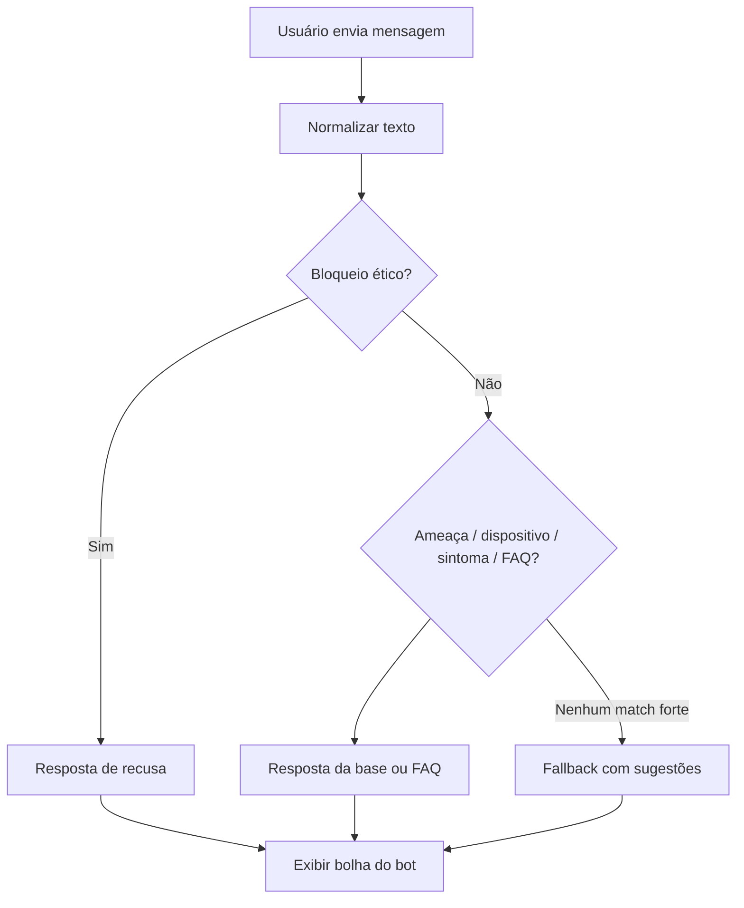

# Assistente AEMS — como rodar e como funciona

O site substituiu o quiz por um **chatbot** educativo sobre tecnologia e cibersegurança. O usuário digita dúvidas em linguagem natural; as respostas vêm da base de conhecimento do projeto, com **filtros éticos** que recusam orientações ilegais (invasão, criação de malware, pirataria, etc.).

## Arquivos principais

| Arquivo | Função |
|---------|--------|
| `ciberseguranca_kb.py` | Base de conhecimento e lógica (fatos, regras, FAQs, `responder_chat`) |
| `export_kb_web.py` | Exporta `kb_web.json` para o navegador |
| `kb_web.json` | Dados serializados (ameaças, dispositivos, seção `chatbot`) |
| `chatbot.html` | Página do assistente |
| `chatbot.js` | Interface de chat + motor de respostas no cliente |
| `index.html` | Link **“FALE COM O ASSISTENTE”** → `chatbot.html` |

O navegador **não executa Python**; ele só lê o JSON gerado pelo export.

## Como rodar localmente

1. **Gerar ou atualizar o JSON** (se alterou o Python):

   ```bash
   python export_kb_web.py
   ```

2. **Servidor local (recomendado)**  
   O chat carrega `kb_web.json` com `fetch`. Abrir `chatbot.html` direto do disco (`file://`) pode bloquear o carregamento em alguns navegadores. Use um servidor na pasta do projeto:

   ```bash
   python -m http.server 8080
   ```

   Acesse: `http://localhost:8080/chatbot.html`

3. **Testar só a lógica em Python** (terminal):

   ```bash
   python -c "from ciberseguranca_kb import responder_chat; print(responder_chat('o que e phishing'))"
   ```

   Ou a demonstração geral da base:

   ```bash
   python ciberseguranca_kb.py
   ```

## Publicar no GitHub Pages

Após mudanças em `ciberseguranca_kb.py`:

```bash
python export_kb_web.py
```

Publique junto com o site, no mínimo: `chatbot.html`, `chatbot.js`, `kb_web.json`, `style.css` e `images/`.

## Como o chatbot funciona

### Fluxo na interface (`chatbot.js`)

1. Carrega `kb_web.json`.
2. Exibe a mensagem de boas-vindas (`chatbot.mensagemBoasVindas`) e **chips de sugestão** (`chatbot.sugestoes`).
3. O usuário envia texto (botão **Enviar**, **Enter** ou clique em uma sugestão).
4. A mensagem do usuário aparece no painel; em seguida o bot responde com `responderChat(mensagem, kb)`.
5. **Limpar** reinicia o histórico e mostra de novo a boas-vindas.

Formatação simples: trechos entre `**` viram negrito; quebras de linha viram `<br>`.

### Ordem de decisão das respostas

A função `responderChat` (espelhada em `responder_chat` no Python) segue esta prioridade:

1. **Mensagem vazia** — pede para o usuário digitar a dúvida.
2. **Bloqueio ético** — padrões em `chatbot.bloqueioEtico` (ex.: “hackear”, “criar vírus”, “piratear”) → recusa educada + orientação legal/preventiva.
3. **Saudações / agradecimentos** — respostas curtas de cortesia.
4. **Definição de ameaça** — se detectar código ou nome (phishing, malware…) e termos como “o que é”, “explique” → `chatbot.ameacaInfo`.
5. **Menção a ameaça** — texto sobre uma ameaça conhecida → mesma ficha informativa.
6. **Dispositivo + segurança** — aliases (`chatbot.dispositivoAliases`) + palavras como “proteger”, “risco”, “ameaça” → cruza `comum`, `sintomas`, `instalado` e regras de recomendação (2FA, backup, perfil exposto).
7. **Sintoma** — nome de sintoma da base → ameaças ligadas por `indicaAmeaca`.
8. **FAQs por palavras-chave** — maior pontuação em `chatbot.faqs` (golpes, senhas, denúncia, VPN, etc.).
9. **Pedido de ajuda** — lista exemplos de `chatbot.sugestoes`.
10. **Fallback** — sugere temas e reforça que não orienta atividades ilegais.

### Base de conhecimento usada no chat

Além das FAQs, o assistente reutiliza dados do modelo Prolog/Python exportados em `kb_web.json`:

- **Dispositivos** — tipos (PC, celular, roteador…).
- **`comum`** — ameaças comuns por dispositivo.
- **`sintomas`** — sintomas registrados no modelo.
- **`instalado`** — medidas de exemplo; calcula **nível de proteção** (alto / médio / baixo).
- **`indicaAmeaca`** — sintoma → possíveis ameaças.
- **`ameacaLabels` / `medidaLabels`** — rótulos legíveis.

As 50 perguntas do antigo quiz permanecem no JSON para compatibilidade com a base, mas **não são mais exibidas** na interface; o foco é conversa livre.

### Diretrizes éticas

Conteúdo em `CHAT_BLOQUEIO_ETICO` e `CHAT_FAQS` em `ciberseguranca_kb.py`. O assistente:

- **Ensina** prevenção, reconhecimento de golpes e boas práticas.
- **Não ensina** invasão, criação de malware, golpes ou pirataria.
- Em pedidos bloqueados, indica **Delegacia Virtual** e uso responsável da tecnologia.

Para alterar respostas fixas ou palavras-chave, edite `CHAT_FAQS`, `AMEACA_INFO`, `CHAT_BLOQUEIO_ETICO` ou `CHAT_SUGESTOES` no Python e rode `export_kb_web.py` de novo.

## Estrutura da seção `chatbot` no JSON

```json
{
  "chatbot": {
    "mensagemBoasVindas": "...",
    "bloqueioEtico": [{ "padroes": ["..."], "resposta": "..." }],
    "faqs": [{ "palavras": ["..."], "resposta": "..." }],
    "ameacaInfo": { "malware": "...", ... },
    "medidaInfo": { "vpn": "...", ... },
    "dispositivoAliases": { "celular": ["celular", "smartphone", ...] },
    "sugestoes": ["O que é phishing?", ...]
  }
}
```

## Exemplos de perguntas

- O que é phishing?
- Como proteger meu celular?
- Quais ameaças são comuns no PC?
- Como denunciar um golpe?
- O que é ransomware?
- Devo usar autenticação em dois fatores?

**Exemplo de bloqueio:** “como hackear wifi” → recusa ética e oferta de conteúdo preventivo.

## Diagrama resumido


